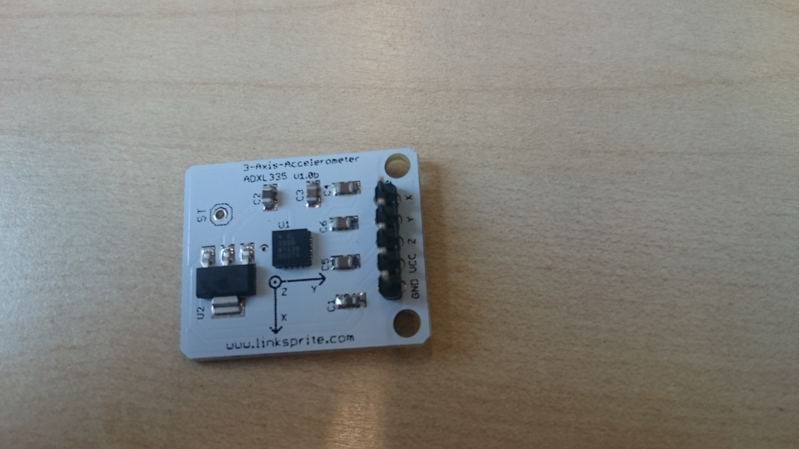
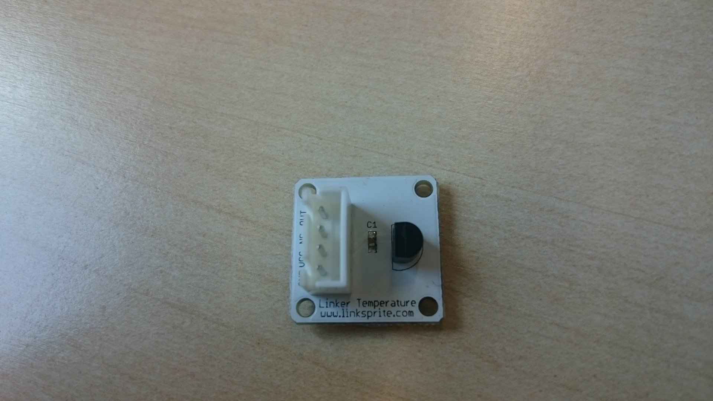
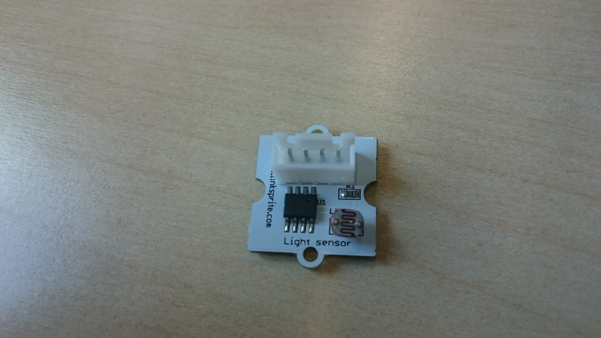
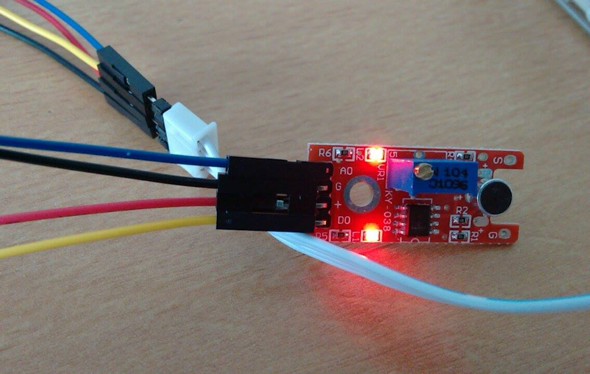
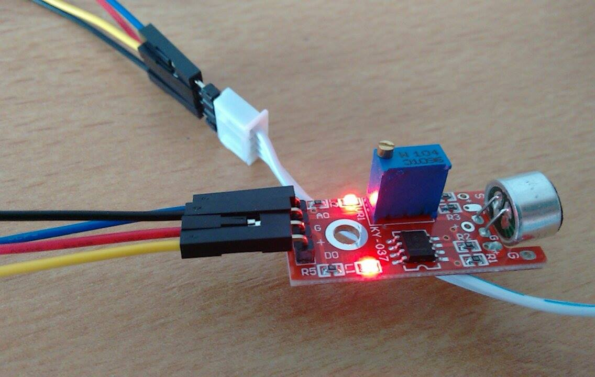
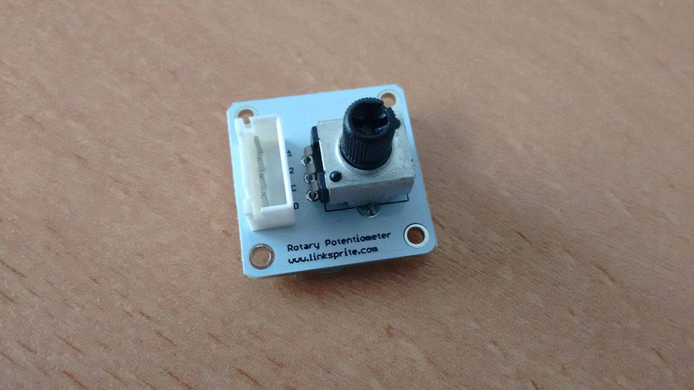
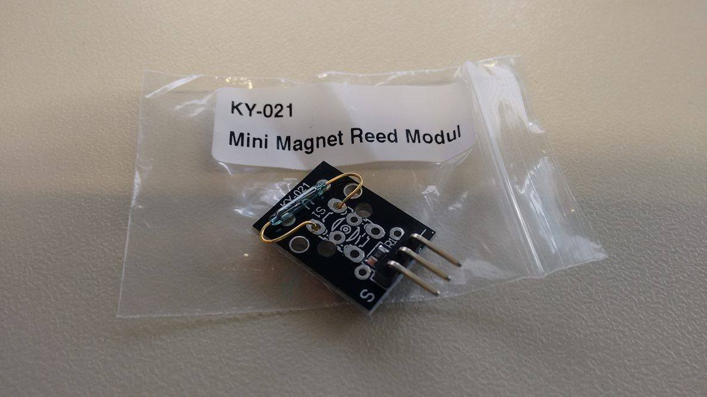

To read analog values, you need to enable SPI.

You can find how to in [this README](../setup-raspberrypi/README.md).

Two version of the board have been used:
* [First version](#first-used-board-version)
* [Second version](#second-used-board-version)

Also, is given a list of [sensors](#sensors-include).

## First used board version

The linksprite board has a 4-channel analog-to-digital converter. You need to use this to read values from analog sensors since the RaspberryPi doesn't have analog inputs.

*Note* that the board has a jumper to set VCC to 3.3V or 5V. Some devices will not work if it's the wrong setting...

## Second used board version

The numbers disposed in the schema above are needed to inform to a given program where the sensor/actor is connected.

### Sensors include
* temperature
* light
* noise level
* 3-axis accelerometer
* Rotary Potentiometer
* Magnet modul

For the temperature sensor, use this python code to convert raw values to degrees celsius:

    temp = (((value * 1000) - 500)/10)
    

* `analogIn.py` shows how to read the values
* `analogInputDemo` display all 4 values in real time; useful for test/debug 

