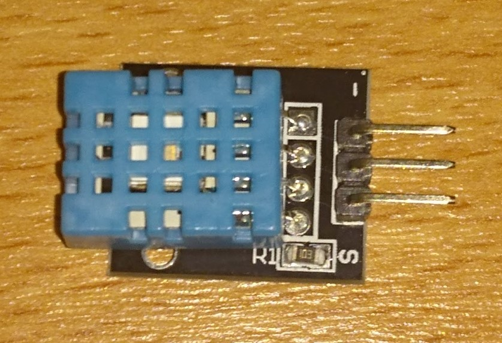

This contains info about several temperature sensors:
* [KY-013 Temperature (analog)](#ky-013)
* [KY-028 Temperature (analog and digital)](#ky-028)
* [KY-015 Temperature and Humidity (digital)](#ky-015)
* [KY-015 Temperature and Pressure (analog)](#ky-052)

## KY-013

The value-temperature formula used in this sensor code might need to be calibrated.
To do that, just use the [example code](ky013.py) and read the real values, relating them to the temperature witha a thermometer.
The pins for the extension board, where (`sensor: board`) - following the [example code](ky013.py):
* -:	G
* (middle pin):	V
* S:	A0

## KY-028

The value-temperature formula used in this sensor code might need to be calibrated.
To do that, just use the [example code](ky013.py) and read the real values, relating them to the temperature witha a thermometer.
The pins for the extension board, where (`sensor: board`) - following the [example code](ky028.py):
* -:	G
* +:	V
* A0:	A0
* D0: 	D27

## KY-015

There are two code versions for that sensor.
The recommended one ([here](ky015/ky015_with_dht11.py)) uses [this library](https://github.com/szazo/DHT11_Python) which is already in [here](ky015/dht11_lib/).
The other one ([here](ky015/ky015_without_dht11.py)) does not use any library.

* -:	G
* (middle pin):	V
* S:	D16

## KY-052

